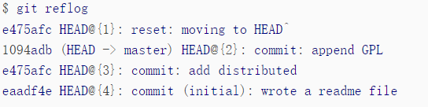

# Dev on WSL 2
Set up the fondamental Linux system,

**reference**: https://dowww.spencerwoo.com/
## cuda and cudnn

Delete old cuda, reference: 
https://cloud.tencent.com/developer/article/2133210

Download cuda:
https://developer.nvidia.com/cuda-toolkit-archive

add to PATH: 
```
vim ~/.zshrc
export PATH="usr/local/cuda-xx.x/bin:$PATH
export LD_LIBRARY_PATH="usr/local/cuda-xx.x/lib64:$LD_LIBRARY_PATH"
```

Download cudnn (Deb):
https://developer.nvidia.com/rdp/cudnn-archive
```zsh
# eg
sudo dpkg -i cudnn-local-repo-ubuntu2204-8.6.0.163_1.0-1_amd64.deb
# the second command appear at the end of runing the first
sudo cp /var/cudnn-local-repo-ubuntu2204-8.6.0.163/cudnn-local-A3837CDF-keyring.gpg /usr/share/keyrings/
sudo apt-get update
sudo apt-get install libcudnn8=8.6.0.163-1+cuda11.8
sudo apt-get install libcudnn8-dev=8.6.0.163-1+cuda11.8
sudo apt-get install libcudnn8-samples=8.6.0.163-1+cuda11.8
```
## Pyenv + Poetry for python environment control

**reference**：https://blog.kyomind.tw/poetry-pyenv-practical-tips/

## install JAX and Pytorch with Poetry

Pytorch:
```zsh
poetry source add -p explicit pytorch https://download.pytorch.org/whl/cpu

poetry add --source pytorch torch
```

JAX:
after ensuring the correct version of cuda and cudnn. 

Edit the `pyproject.toml` as:

```zsh
[[tool.poetry.source]]
name = "PyPI"
priority = "primary"

[[tool.poetry.source]]
name = "jorenham/jax_pep503"
url = "https://jorenham.github.io/jax_pep503/"
priority = "supplemental"

[tool.poetry.dependencies]
python = ">=3.10,<3.13"
jax = {extras = ["cuda"], version = "0.4.19"}
```
In terminal: run
`poetry lock` then
`poetry install`

## Git

### Initialization

First, initialize Git in the folder where we want to keep a record.

```zsh
> cd <folder>
> git init
```

### Version Control

#### Tracking Modifications

Distinct three "spaces" : Working directory and Stage and Repository of version.

Write or edit a file in the folder ( modifications in working directory ), then

* use `git add` to tell Git to add the modifitions (into Stage).
  
    ```zsh
    > git add <file>
    ```

* use `git commit` to instruct Git to commit the files to the Repo of version of git.

    ```zsh
    > git commit -m <comment>
    ```

    The text provided after the '-m' flag is used to input a description for this particular commit, describing the purpose or content of the changes made in this commit.

**Rk: Not necessarily one `git add` followed by one `git commit`.**
Tracking changes, first modification -> `git add`-> second modification -> `git add` -> `git commit` (committing both modifications merged together).

If we've done some edits or modifications but haven't staged or committed them:

* `git status` can display the status in both working directory and Stage space.

* If `git status` informs you that files have been modified, you can use `git diff <file>` to view the changes made. Knowing what changes have been made to file, it's much more reassuring to commit it to the repository. Committing changes and adding new files are the same two steps.
* `git checkout -- <file>` : discard changes in Working directory.
* `git reset HEAD <file>` : Unstage and return the modifications back to Working directory. (Then can `git checkout -- <file>` to discard it).

#### Version Time Travel

* The version pointed to by `HEAD` is the current version, so Git allows us to travel between versions in history using the `git reset --hard commit_id` command.

* Before traveling, you can use `git log` to view the commit history to determine which version you want to roll back to.
  
* To return to the future, use `git reflog` to view the command history to determine which version in the future you want to return to


#### File Delete

After deleting files in the working directory, `git status` can inform you about the deleted files.

1. To permanently delete these files: Use git rm followed by git commit.
2. To recover: `git checkout -- <file>`.

### Remote Repository

```git remote add origin git@github.com:R-graveolens/<repos>.git```

* for first time ```git push -u origin main```
* then ```git push origin main```
